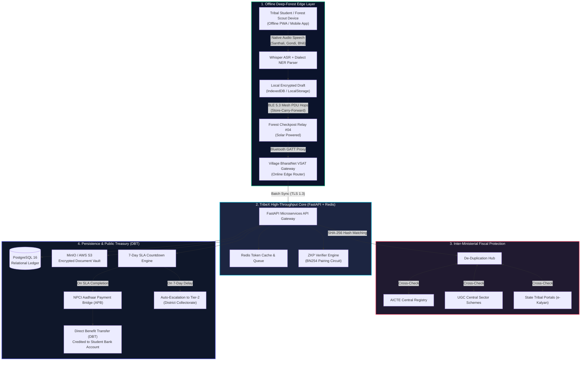

# TribeX AI: An Offline-First, AI-Driven Unified Tribal Scholarship Ecosystem

> **Designed for the Ministry of Tribal Affairs (MoTA), Government of India**  
> **Official Repository:** [https://github.com/ansh09315-oss/TRIBEX.AI](https://github.com/ansh09315-oss/TRIBEX.AI)  
> **Live Production URL:** [https://tribex-ai-three.vercel.app](https://tribex-ai-three.vercel.app)  
> **Deployment Status:** [](https://tribex-ai-three.vercel.app)

---

## 🏛️ Project Summary: Why TribeX AI Matters

India's Scheduled Tribe (ST) communities represent over 104 million citizens across 705 distinct ethnic groups and 75 Particularly Vulnerable Tribal Groups (PVTGs). Despite generous central schemes—such as the National Fellowship for Higher Education of ST Students (NFST) and National Overseas Scholarship (NOS)—tribal scholars face systemic exclusions:

1. **The Deep-Forest Connectivity Divide**: Forest-dwelling tribal students in remote zones (e.g., Abujhmad, Bastar, Niyamgiri, and Nallamala Hills) lack mobile tower coverage. Applications close while students are physically disconnected from 4G/5G networks.
2. **Linguistic & Administrative Friction**: Portals operate in English or standard Hindi, alienating first-generation learners speaking native dialects such as Santhali, Gondi, and Bhili.
3. **Physical Verification Bottlenecks & Document Tampering**: Students travel up to 50km to tehsil headquarters for caste validity and income notarization. Conversely, fraudulent double-dipping across central (MoTA, AICTE, UGC) and state databases costs the treasury crores annually.
4. **Bureaucratic Inertia**: Applications traditionally languish across officer desks for 120–180 days, triggering preventable college dropouts before institutional fee deadlines.

**TribeX AI** solves these systemic bottlenecks with an ultra-modern, high-trust digital public infrastructure (DPI) combining offline Bluetooth Low Energy (BLE) mesh routing, cross-lingual voice AI, Zero-Knowledge cryptographic verification, and an automated 7-day Direct Benefit Transfer (DBT) escalation engine.

---

## ⚡ Core Innovation Pillars

### 1. BLE Mesh Sync (Deep-Forest Filing via Delay-Tolerant Networking)
- **Zero Mobile Tower Dependency**: Field scouts, tribal volunteers, and students file complete applications offline on mobile devices inside dense forest canopies.
- **Store-Carry-and-Forward Routing**: Packets hop device-to-device via Bluetooth Low Energy 5.3 Advertising PDUs across village checkposts until encountering an Internet-connected gateway (BharatNet VSAT or CSC terminal), triggering an encrypted batch synchronization.

### 2. Zero-Knowledge Cryptographic Trust Layer (Tamper-Proof Verification)
- **Zero Raw Document Uploads**: Eliminates physical affidavit photostats and PDF document tampering.
- **zk-SNARKs (Groth16 / BN254 Curve)**: Computes a client-side cryptographic proof verifying that $\text{Income} \le \text{Threshold}$ and $\text{Tribe ID} \in \text{State Merkle Root}$. MoTA verifiers confirm eligibility in under 80ms without storing or exposing sensitive Aadhaar numbers or caste certificates.

### 3. Automated 7-Day SLA Escalation Engine (Administrative Accountability)
- **Strict Node Accountability**: Every application is tied to an immutable 7-day processing deadline per administrative verification node.
- **Dynamic Tier Promotion**: If an institutional nodal officer fails to verify within 7 days, the file is automatically bypassed and escalated to the **District Collectorate (Tier 2)** and ultimately the **MoTA Joint Secretary (Tier 3)**, accompanied by SMS and automated dispatch logs.

---

## 📐 Visual System Architecture



---

## 💻 Technology Stack Table

| Layer | Technologies & Frameworks | Purpose & Implementation |
|---|---|---|
| **Frontend Client (Web/PWA)** | React 19, Vite 8, TypeScript, Tailwind CSS v4, Framer Motion, Lucide Icons | High-trust fintech aesthetic (Linear/Stripe), responsive design, offline-first PWA with Service Worker asset caching. |
| **Mobile Client** | Flutter / Dart | Native Android application for offline Bluetooth Low Energy GATT mesh operations. |
| **Backend API** | FastAPI (Python 3.11+), Pydantic v2, Uvicorn, SQLAlchemy (Async) | Asynchronous, high-throughput microservices handling ZKP verification, deduplication, and SLA workflows. |
| **AI & Speech Pipelines** | OpenAI Whisper (ASR), EasyOCR, Bhashini API integration | Spoken speech-to-text parameter parsing across 5 dialects (Santhali, Gondi, Bhili, Hindi, English). |
| **Cryptographic Trust** | Groth16 zk-SNARKs, Poseidon Hashing, py_ecc (BN254 Pairing) | Zero-Knowledge mathematical verification of income ceilings and State Tribe Registry roots. |
| **Primary Database** | PostgreSQL 16 Alpine, `uuid-ossp`, `pgcrypto` | Relational applications ledger, hashed identities, and SLA escalation logs with B-Tree indexes. |
| **In-Memory Cache & Queue** | Redis 7 Alpine (AOF Persistence enabled) | Sub-millisecond duplicate token lookups and asynchronous batch upload task queues. |
| **Object Storage** | MinIO / AWS S3 (AES-256 Server-Side Encryption) | Encrypted storage vault for official sanction orders and audit certificates. |
| **DevOps & Cloud** | Docker, Docker Compose, Nginx, Vercel, Netlify | Multi-container orchestration, reverse proxy with Gzip compression, and production PWA hosting. |

---

## 🛠️ Local Development & Quickstart Guide

### Prerequisites
- **Node.js**: `v20.0+` & `npm` / `yarn`
- **Python**: `3.11+`
- **Docker & Docker Compose**: (Optional, for running PostgreSQL, Redis, and MinIO locally)
- **Git**: Installed and configured

### 1. Clone the Repository
```bash
git clone https://github.com/ansh09315-oss/TRIBEX.AI.git
cd TRIBEX.AI
```

### 2. Frontend Setup (React PWA)
```bash
# Navigate to project root or frontend/
npm install

# Start Vite Development Server
npm run dev
# Access frontend at: http://localhost:5173/
```

### 3. Backend Setup (FastAPI Python)
```bash
# Navigate to backend directory
cd backend

# Create and activate virtual environment
python -m venv venv
# Linux/macOS:
source venv/bin/activate
# Windows (PowerShell):
venv\Scripts\Activate.ps1

# Install dependencies
pip install -r requirements.txt

# Launch FastAPI development server
uvicorn app.main:app --host 0.0.0.0 --port 8000 --reload
# Access Swagger UI Documentation at: http://localhost:8000/api/v1/docs
```

### 4. Running Full Stack via Docker Compose
To run PostgreSQL 16, Redis 7, MinIO, and FastAPI together:
```bash
cd deployment
docker compose up -d

# Verify services:
# Frontend SPA: http://localhost:80
# Backend API: http://localhost:8000/api/v1/docs
# MinIO Vault Console: http://localhost:9001 (minio_tribex_admin / minio_tribex_secure_password_2026)
# PostgreSQL: localhost:5432
```

---

## 🔐 Environment Configuration (`.env.example`)

Copy the template below to `.env` in the repository root:

```env
# Application Core
ENVIRONMENT=development
API_V1_STR=/api/v1
SECRET_KEY=your_64_character_hex_production_secret_key_here
SECURITY_SALT_PEPPER=tribex_mota_secure_salt_pepper_2026

# Frontend Client
VITE_API_URL=http://localhost:8000/api/v1
VITE_ENABLE_MOCK_BLE=true

# Database (PostgreSQL)
POSTGRES_SERVER=localhost
POSTGRES_PORT=5432
POSTGRES_USER=tribex_admin
POSTGRES_PASSWORD=tribex_secure_pass_2026
POSTGRES_DB=tribex_db

# Redis Cache
REDIS_HOST=localhost
REDIS_PORT=6379

# MinIO / AWS S3
S3_ENDPOINT=http://localhost:9000
S3_ACCESS_KEY=minio_tribex_admin
S3_SECRET_KEY=minio_tribex_secure_password_2026
S3_BUCKET_NAME=tribex-encrypted-vault
```

---

## 📄 License & MoTA Compliance

TribeX AI is engineered in strict compliance with the **National Data Governance Framework (NDGF)**, the **Digital Personal Data Protection (DPDP) Act**, and the **Direct Benefit Transfer (DBT) Mission** guidelines of the Government of India.
